# ⚡ Majid Moharami
### Senior Android Developer & Mobile Architect • 20M+ MAU @ Myket

 

<!-- Hero Action Buttons -->

  
  &nbsp;&nbsp;
  
  &nbsp;&nbsp;
  

 

<!-- Contribution Activity Heatmap -->
## 📊 Activity & Contributions

  

<!-- Executive & Engineering Leadership Cards -->
## 🚀 Engineering Leadership & Architecture

<table>
  <tr>
    <td valign="top">
      
    </td>
    <td valign="top">
      
    </td>
  </tr>
</table>

 

<!-- Direct Recruiter Action Row -->
## 📬 Direct Recruiter Connect

  
  &nbsp;&nbsp;
  

 

<!-- Tech Stack & Arsenal -->
## 🛠️ Core Tech Stack & Arsenal

  
  
  
  
  

  
  
  
  
  

  
  
  
  

 

  ⚡ Designed & Built with Jetpack Compose & Clean Architecture Principles

